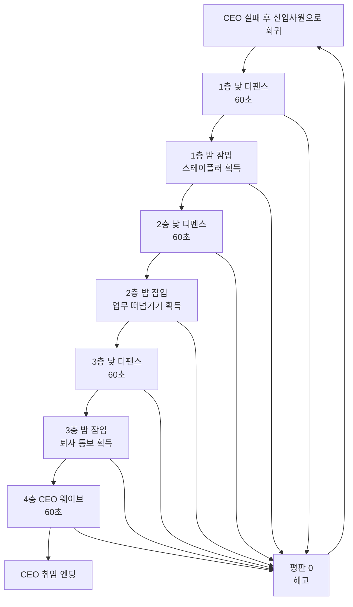

# Rookie to CEO — Game Design Document

- 장르: 낮밤 회사 디펜스 → 평판 지켜서 CEO 되기, 2D
- 차별점: 회귀물 디펜스 — 몬스터가 아닌 사무용품이 적, 회복 아이템은 커피
- 컨셉: 아포칼립스가 아닌 "일상물"이라는 신선한 소재 사용

## 0. 컨셉 요약

- **낮**: 회사에서 몰려드는 업무를 디펜스
- **밤**: 몰래 회사에 침투해 정보(성장 요소)를 훔침
- **공격**: 키보드 샷건, 스테이플러 연사, 업무 떠넘기기(액티브), 퇴사 통보(궁극기, 공포)
- **HP**: 멘탈이 다 닳으면 평판 하락. 평판 == 목숨. 평판을 다 잃으면 재입사(회귀)

### 게임 루프
- 전투 시점: 탑뷰
- 통과 시점: 디펜스를 다 막으면 통과
- 성장 요소: 밤에 경비/야근을 피해 서류를 훔쳐보며 스탯 강화

### 전체 게임 구조
과거 CEO였던 주인공이 실패 후 신입사원 시절로 회귀
```
1층 낮 디펜스 → 1층 밤 잠입(신규 무기 획득)
→ 2층 낮 디펜스 → 2층 밤 잠입(신규 무기 획득)
→ 3층 낮 디펜스 → 3층 밤 잠입(궁극기 획득)
→ 4층 CEO 웨이브 → CEO 엔딩
```

낮 전투는 층마다 1분, 밤 탐방은 60초. 전체 플레이 시간은 연출·선택 시간 포함 약 10~12분.

## 1. 방어 대상

**A안 채택: 플레이어만 방어**
- 별도의 기지나 핵심 프로젝트 없음
- 모든 적은 플레이어를 공격
- 플레이어가 1분 동안 살아남으면 해당 층 통과
- 마지막에 남아 있는 적을 모두 처리할 필요 없음
- 60초가 되면 남은 일반 업무는 처리 완료 연출과 함께 사라짐

장르는 디펜스지만 실제 전투 방식은 사방에서 밀려오는 업무를 처리하며 생존하는 탑뷰 서바이버형 디펜스이다.

## 2. 조작 방식

**C안 채택: 기본 공격 자동, 액티브·궁극기 수동**

| 조작 | 기능 |
|---|---|
| WASD | 플레이어 이동 |
| 자동 | 가장 가까운 적을 기본 무기로 공격 |
| Space | 업무 떠넘기기 |
| R | 퇴사 통보 궁극기 |
| E | 밤 탐방 상호작용 |
| Shift | 밤 탐방 달리기 |

마우스 조준은 사용하지 않는다. 플레이어는 움직이는 데 집중하고, 위험할 때 액티브·궁극기를 직접 사용한다.

## 3. 무기 획득 구조

밤마다 정해진 무기를 하나씩 획득하는 **고정 획득** 방식 (선택지 다중화는 콘텐츠 비용이 크므로 첫 버전 제외).

### 시작 무기: 키보드 샷건
- 게임 시작부터 보유
- 가장 가까운 적 방향으로 자동 공격, 부채꼴 범위 공격
- 가까운 적 여러 명을 동시에 공격
- 공격속도는 느리지만 범위가 넓음

### 1층 밤 보상: 스테이플러 연사
- 빠른 원거리 자동 공격, 가장 가까운 적 한 명을 공격
- 키보드 샷건의 느린 공격 사이를 보완
- 레벨이 오르면 연사속도와 관통 횟수 증가

### 2층 밤 보상: 업무 떠넘기기 (Space, 액티브)
- 플레이어 주변의 적을 바깥쪽으로 밀어냄
- 밀려난 적은 잠시 다른 업무와 충돌
- 위기 탈출용 기술, 기본 쿨타임 12초

### 3층 밤 보상: 퇴사 통보 (R, 궁극기)
- 화면의 일반 적에게 공포 적용 → 일반 업무가 플레이어 반대 방향으로 도망감
- 정예 적은 느려짐, CEO 웨이브는 3초간 정지
- 적을 처리하면 궁극기 게이지 충전
- 4층 진입 시점에 모든 공격 시스템이 완성됨

## 4. 낮 스탯 성장

업무 처리 → 경험치 서류 드롭 → 플레이어가 가까이 가서 획득 → 경험치가 차면 레벨업 → 강화 3개 중 하나 선택. 레벨업 선택 중에는 게임 시간을 멈춘다.

| 표시 명칭 | 실제 효과 |
|---|---|
| 업무처리력 | 모든 무기 공격력 증가 |
| 손속도 | 기본 무기 공격속도 증가 |
| 눈치 | 이동속도 증가 |
| 멘탈 관리 | 최대 HP 증가 및 일부 회복 |
| 일머리 | 공격 범위 증가 |
| 짬 | 액티브 스킬 쿨타임 감소 |

한 층에서 약 2~3번 레벨업하도록 경험치를 조절한다 (전체 플레이에서 약 8~10번 레벨업).

스탯은 다음 층까지 유지되지만, 평판을 모두 잃고 회귀하면 초기화된다.

### 회복 아이템
적이 낮은 확률로 커피를 드롭.
- 아메리카노: HP 소량 회복
- 믹스커피: HP 회복 + 5초간 공격속도 증가

프로토타입에서는 아메리카노 하나만 구현해도 충분하다.

## 5. 층별 낮 디펜스 구조

각 층의 제한 시간은 60초.

**공통 시간 구성**
- 0~15초: 기본 업무 등장
- 15~30초: 적 종류 추가
- 30초: 상사의 시선 발동
- 30~45초: 적 생성량 증가
- 45~60초: 해당 층의 특수 업무 등장
- 60초: 생존하면 층 통과

### 1층: 신입사원 구역 — 기본 조작 학습
- 등장 적: 이메일 봉투, 서류 더미
- 적 이동속도가 느리고 생성량이 적음, 키보드 샷건만 사용
- 30초에 상사의 시선 시스템 소개
- 클리어 후 밤에 스테이플러 획득

### 2층: 실무팀 구역 — 빠른 업무 추가
- 등장 적: 이메일 봉투, 서류 더미, 긴급 수정 포스트잇
- 포스트잇이 빠르게 돌진, 서로 다른 속도의 적을 피해야 함
- 스테이플러로 빠른 적을 우선 처리
- 클리어 후 밤에 업무 떠넘기기 획득

### 3층: 임원 구역 — 방해형 업무 추가
- 등장 적: 기존 적 전체, 회의 요청 달력, 클레임 전화기
- 회의 요청은 공격속도 감소, 클레임 전화기는 원거리 공격
- 적 생성량 크게 증가, 업무 떠넘기기로 포위 상황 탈출
- 클리어 후 밤에 퇴사 통보 획득

### 4층: CEO 구역 — 최종 웨이브
- 0~20초 기존 업무 다수, 20~40초 정예 업무 + 상사의 시선 강화, 40~60초 CEO 최종 지시사항 웨이브
- 60초까지 생존하면 최종 클리어
- CEO를 직접 공격하지 않는다. CEO의 최종 업무 지시가 보스 역할을 한다.

## 6. 적 구성

모든 적은 플레이어만 공격한다.

| 적 | 역할 | 행동 |
|---|---|---|
| 이메일 봉투 | 기본 적 | 플레이어에게 직선 이동 |
| 서류 더미 | 탱커 | 느리지만 높은 HP |
| 긴급 수정 포스트잇 | 돌진형 | 잠시 멈춘 후 빠르게 돌진 |
| 회의 요청 달력 | 디버프형 | 가까이 오면 공격속도 감소 |
| 클레임 전화기 | 원거리형 | 일정 거리에서 전화 공격 |
| CEO 최종 지시서 | 보스형 | 업무 소환과 범위 공격 |

적은 플레이어와 접촉하거나 공격에 성공하면 HP를 감소시킨다.

## 7. HP와 평판

### 플레이어 HP (멘탈로 표시)
- 적에게 공격당하면 멘탈 감소
- 커피를 먹으면 멘탈 회복
- 멘탈 관리 스탯으로 최대치 증가
- 멘탈이 0이 되면 평판 감소

### 평판 (= 목숨)
- 기본 평판 3
- HP가 0이 되면 평판 1 감소 → 2초 후 HP 전체 회복 → 제자리에서 부활 → 부활 후 3초간 무적 → 웨이브 시간은 계속 진행

```
HP 0 → 평판 -1 → HP 전체 회복 → 3초 무적 → 계속 전투
```

### 평판이 모두 사라졌을 때
```
평판 0 → 해고 → 재입사 → 1층으로 회귀
```

**초기화되는 것**: 낮에 올린 스탯, 밤에 획득한 무기, 현재 층, 현재 HP, 평판
**유지되는 것**: 없음. 회귀는 영구 성장 시스템이 아니라 스토리·재도전 연출로 사용한다.

## 8. 회귀 도입 스토리

주인공은 오랜 회사 생활 끝에 CEO가 되었지만, 취임 첫날 회사가 무너지고 모든 책임을 뒤집어쓴다. 정신을 잃은 뒤 눈을 떠보니 신입사원으로 처음 출근했던 날로 돌아와 있다. 이번에는 회사의 구조와 미래를 알고 있다는 기억을 이용해 다시 CEO 자리까지 올라가야 한다.

평판을 모두 잃으면:
```
"당신은 해고되었습니다." → "하지만 출근은 끝나지 않았습니다." → 알람 소리 → 첫 출근 날로 회귀
```

인트로는 처음 한 번만 길게, 재도전 때는 짧은 알람 연출 후 바로 시작.

## 9. 상사의 눈치 시스템

별도의 NPC 시스템 없이 낮 전투의 맵 기믹으로 사용한다.

**작동 방식**
- 층마다 30초에 한 번 발동
- 발동 2초 전 "상사가 보고 있습니다" 경고
- 화면에 붉은 시선 영역 표시, 시선이 한쪽에서 반대쪽으로 천천히 이동
- 시선에 걸리면 플레이어가 2초간 "일하는 척" 상태 (이동은 가능하지만 자동 공격 정지)
- 추가 적 소환이나 평판 직접 감소는 없음 (공격 중단 패널티만)

**층별 변화**: 1층 시선 이동속도 느림 / 2층 시야 범위 증가 / 3층 시선이 두 번 이동 / 4층 CEO 웨이브 중 한 번 추가 발생

## 10. 밤 탐방 구조

1~3층 낮 디펜스 통과 후 발생 (4층은 최종 층이라 밤 탐방 없이 엔딩으로 이어짐).

**목표**: 무기가 있는 방까지 이동 → 서류/장비 조사 → 신규 무기 획득 → 제한 시간(60초) 안에 비상계단으로 탈출

- 무기를 얻는 것만으로는 성공이 아님, 60초 안에 출구까지 돌아와야 성공
- 무기를 얻지 않고 바로 탈출할 수도 있지만 보상 없음

**방해 요소** (프로토타입 구현 범위): 경비원 2명, CCTV 1개, 책상 장애물, 조사 대상 1개, 출구 1개
(보류: 야근 중인 직원, 잠긴 문, 불이 켜진 구역)

## 11. 밤 발각과 실패

경비/CCTV 시야에 들어가면 즉시 탈락 (추격전 없음).

```
경비 시야 진입 또는 CCTV 시야 진입 → 즉시 야간 탐방 실패
```

**실패 결과**: 획득하려던 무기를 얻지 못함 → 평판 1 감소 → 다음 층으로 강제 이동 (평판 0이면 1층으로 회귀). 제한 시간 종료 시에도 동일하게 처리.

이렇게 하면 밤 탐방이 위험하지만 한 번 실패했다고 전체 게임이 끝나지는 않는다.

## 12. 밤 무기 획득 과정

상자 개봉이 아니라 회사 서류를 통해 무기를 배우는 방식으로 표현한다.

| 층 | 조사 대상 | 획득 |
|---|---|---|
| 1층 밤 | 비품실의 자동 스테이플러 설계서 | 스테이플러 연사 |
| 2층 밤 | 팀장 PC의 업무 분배 규칙 | 업무 떠넘기기 |
| 3층 밤 | 임원실의 비밀 사직서 | 퇴사 통보 |

무기를 획득한 뒤 출구까지 탈출해야 실제로 보유하게 된다.

## 13. CEO 최종 웨이브

최종 목표는 4층의 CEO 웨이브를 60초 동안 막는 것.

**CEO 최종 지시사항 패턴**
- 0~20초 "업무 폭탄": 일반 업무 생성량 증가, 사방에서 이메일·서류 등장
- 20~40초 "전면 수정": 긴급 수정 포스트잇 연속 돌진, 회의 요청 달력이 공격속도 감소, 상사의 시선 발동
- 40~60초 "퇴근 취소": CEO 최종 지시서 등장, 일반 업무 계속 소환, 바닥에 빨간 업무 구역 생성(지속 피해). 퇴사 통보 사용 시 보스 패턴 3초 중단

60초까지 평판이 남아 있으면 성공. CEO 자체를 쓰러뜨리는 것이 아니라, CEO가 던진 모든 업무를 처리해 능력을 증명하는 것으로 표현한다.

```
CEO 웨이브 방어 성공 → 기존 CEO 퇴사 → 주인공 CEO 취임 → 엔딩
```

## 14. 최종 MVP 범위

| 항목 | 구현 수량 |
|---|---|
| 플레이어 | 1명 |
| 낮 전투 층 | 4개 |
| 밤 탐방 | 3개 |
| 낮 전투 시간 | 층당 60초 |
| 밤 탐방 시간 | 층당 60초 |
| 일반 적 | 5종 |
| 최종 보스형 적 | 1종 |
| 자동 무기 | 2종 |
| 액티브 스킬 | 1종 |
| 궁극기 | 1종 |
| 낮 성장 스탯 | 6종 |
| 회복 아이템 | 1종 |
| 경비원 | 1종 |
| CCTV | 1종 |
| 평판 | 3 |
| 엔딩 | 1개 |

시설, 자유로운 무기 선택, 영구 성장, 여러 회사, 동료 시스템은 전부 보류한다.

### 최종 플레이 흐름



## 남은 기획 과제

핵심 게임 규칙은 정리 완료. 남은 주요 기획은 밸런스 표 확정이다 (무기 수치, 적 수치, 층별 적 생성량, 레벨업 강화 수치) — [DEVELOPMENT_PLAN.md](./DEVELOPMENT_PLAN.md)에서 추적한다.
